# What is "Mar.JoyofQC"?
This is a Shiny app that facilitates the visualization of data.  It's purpose is to support the identification and flagging of outliers in your data.

## Installation
Ensure you have R installed with the following packages:
    + Shiny
    + ggplot2

```R
install.packages("shiny")
install.packages("ggplot2")
```
## Running
Running this package is relatively straightforward.  

*  Download and extract the zip file [download the zip file](https://github.com/Maritimes/Mar.JoyofQC/archive/master.zip)

If you have RStudio, you can open either ui.R or server.R and click "Run".  

Alternatively, you can change your working directory to the location of your unzipped files, and write `shiny::runapp()`

```R
setwd("C:/Users/me/Downloads/Mar.JoyofQC-master")
shiny::runApp()
```

## Usage
In short, you load data into the app, plot various fields against
eachother, and use the plot(s) to identify data that's interesting.  
Points on the plot(s) can be selected to reveal the underlying 
data, and can be flagged as 'good' or 'bad', and comments can 
be applied to the records. When you're done, you can save your 
work such that you have a list of all of the records you need 
to edit in the source location.  Alternatively, you can save
your session so that you can return to your QC'ing another
time without forgetting where you were.  What a Joy!

The app has a number of controls that allow you to do all 
of this stuff, and an outline of the app
(as of Feb 7, 2019) is shown below, with the various sections
identified with numbers.  The sections are described below the 
image.

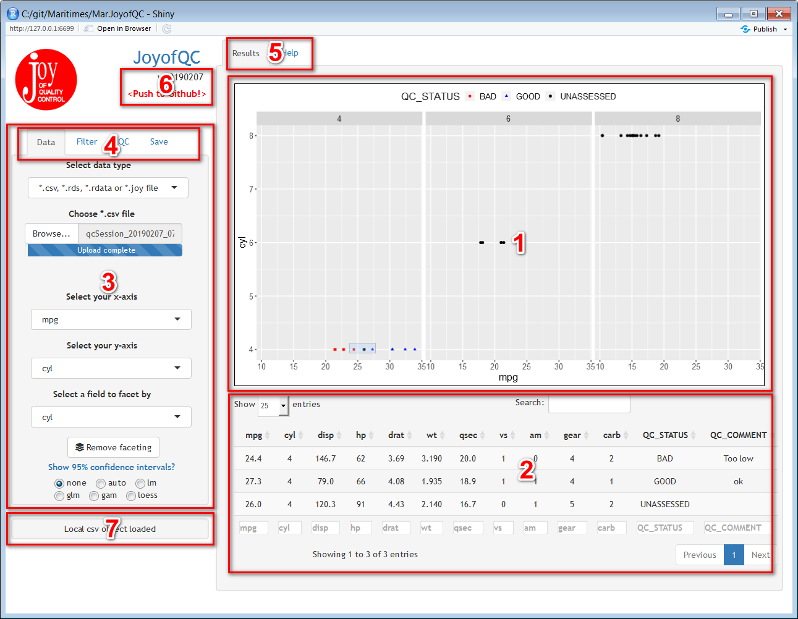

### Box #1
This is your plot area.  Depending on your selected facet options, at least 
one plot will be shown here.  Plots here are always interactive - you can draw 
boxes on them to select points, you can double-click on selections to zoom in.?
The selected points are impacted by the tools in the QC tab (Box #4). Unassessed, 
'Good' and 'Bad' data are all displayed differently, and the data for selected points
are displayed in the table below (Box #2)

### Box #2
This is where the underlying data for selected points is shown.  Any QC decisions 
or comments you've applied will be visible here.  Data can be sorted or filtered 
using tools within the table.

### Box #3
On the left of the app are the controls for selecting and working with
datasets.

### Box #4
These tabs allow you to switch between tools for Displaying, Filtering, QC'ing 
and Saving data.  The tab for selecting/ displaying data is shown by default. Content of 
the individual tabs is shown below.

#### Data

| |  |
|--------------------------|----------------------------------------------------|
| | This will be the only thing tool shown initially, and lets you choose which dataset you want to look at (i.e. csv, rds, rdata, oracle, etc). This (default) tab contains tools allowing you to decide how to plot your data. You can select any of your fields to use as x or y axes, and you can also select an (optional) 'facet' field. This field groups the data by shared values from the facet field, and will generate one plot for each unique facet value.  For example, you might choose to plot 'length' vs 'weight' (as the x and y axes), but then facet the plots by 'species'.  The would result in a separate length vs weight plot for each species. Since the purpose is to QC the data, these options allow you to show the 95% confidence intervals for the data.  There   are  a variety of methods for doing this, and they are described  [here](https://ggplot2.tidyverse.org/reference/geom_smooth.html)|

#### Filter
|                          |                                                    |
|--------------------------|----------------------------------------------------|
|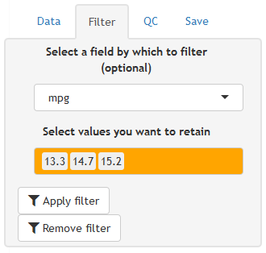 | In this tab, you can identify a field by which you would like to filter your data.Once a field has been selected, a second box gets populated allowing you to select from any of the values that appear in that field.  Modifications here will change which data is displayed (and available for QC).  Data that is not displayed still exists,    and will still be present (retaining your QC efforts) in any saved files. |

#### QC
|                          |                                                    |
|--------------------------|----------------------------------------------------|
|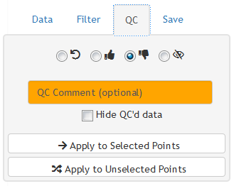| This box contains the options for QC'ing your data.  The first row of tools at the top of the page work on the selected data, and allow you to apply a QC status to individual records.The following actions can be applied to any selected data: |

*  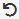 - This returns rows to their orignal state - all QC information including comments is removed
*  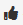 - This applies a value of 'good' to the QC_STATUS column.  Data with this status will be shown as red squares.
*  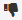 - This applies a value of 'bad' to the QC_STATUS column.  Data with this status will be shown as blue triangles.
*  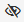 - This does not modify the data, but causes the selection to be hidden
*  (orange text box) - Text written in this box is applied to all of the selected records.
*  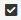 'Hide QC'd data' - If this box is ticked, QC information will be applied, and the data will be hidden immediately after.
*  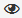 - If data is hidden, an 'Unhide all' button bearing this image will be shown, allowing you to reveal all of the data again

#### Applying the tools
Nothing happens with the selections you made above until you click either  Apply to Selected Points' or  Apply to Unselected Points'.
Most of the time, you will be working with your seletion, but sometimes it might be nice to able to easily work on all of the other data instead.

#### Save
|                          |                                                    |
|--------------------------|----------------------------------------------------|
|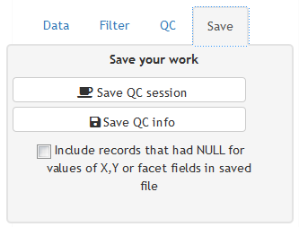 |This tab shows buttons for saving your work.  There are 2, and they are slightly different. 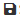 Save QC info' saves ONLY the records you've interacted with (i.e. set a status of 'good' or 'bad').  The idea is that if you're working with a large dataset that you need to cleanup, you can use this button to retain only those few records that have issues.Alternatively, 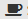 Save QC session' saves the entire dataset, including comments, QC statuses, whether data was hidden,  as well as any data you have not interacted with.  If you have a coworker, intern or some other person working with you, you can exchange *.joy files to see how they have categorized the data.|

### Box #5
These are the tabs that allow you to switch between the interface and the help.  

### Box #6
The area identifies the version of the app you are using, and whether or not a newer version exists.  Please ensure you are always using the newest possible version.

### Box #7
This is a status info area that provides information about recent actions 

### I Need More Help!
For assistance with this app, please contact [email Mike McMahon](mailto:Mike.McMahon@dfo-mpo.gc.ca) (Population Ecology Division, DFO)
